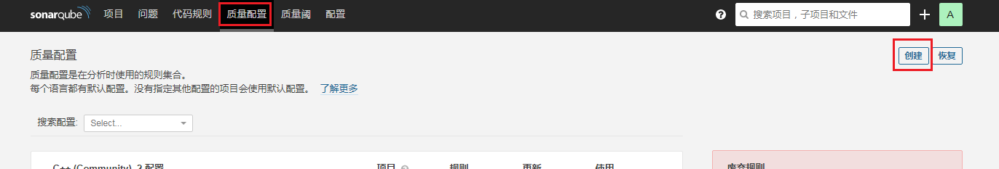
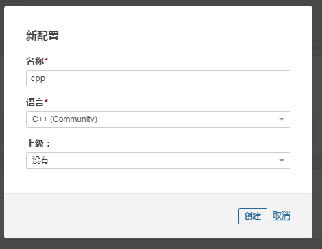
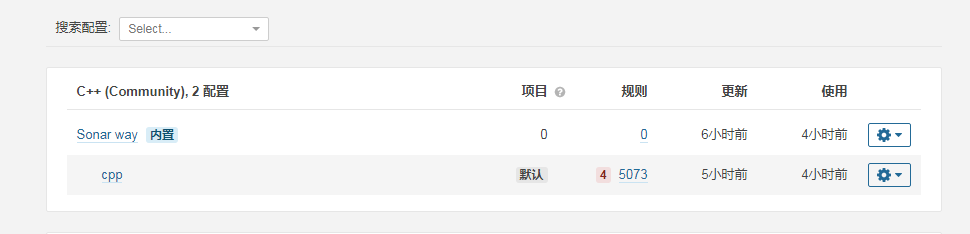
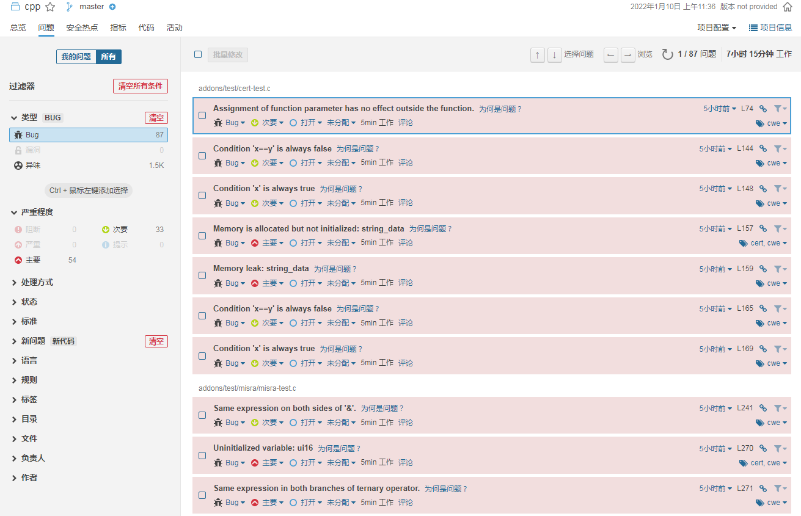
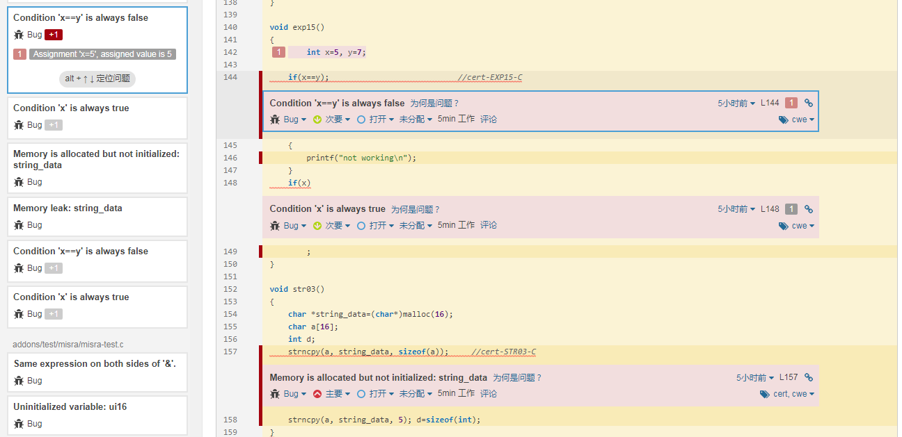

本文的使用**SonarQube**配置c/c++扫描插件，以及通过**cppcheck**扫描并上传扫描结果至SonarQube中。

<!--truncate-->
## 准备环境
+ SonarQube社区版(自行安装)
+ [sonar-cxx-plugin](https://github.com/SonarOpenCommunity/sonar-cxx)
+ [cppcheck](https://github.com/danmar/cppcheck)
+ cppcheck所需的nodejs环境（NodeJS 8+）

## SonarQube安装插件
进入sonar插件目录，将`.jar`文件拷贝至该目录下(或直接下载)：
```shell script
cd /opt/sonarqube-8.4.2.36762/extensions/plugins

wget https://github.com/SonarOpenCommunity/sonar-cxx/releases/download/cxx-1.3.2/sonar-cxx-plugin-1.3.2.1853.jar

chown sonar.sonar sonar-cxx-plugin-1.3.2.1853.jar
```
下载完成后重启sonarqube。

## Sonar配置C++的代码扫描规则
进入代码规则，点击**创建**

创建规则：

将所有规则激活，并设置为默认（保证cpp为默认，并且规则数有很多）。


## 扫描环境配置
### 采用命令的方式安装cppcheck
```bash
yum -y install cppcheck
```
### jenkins流水线配置
1、 执行cppcheck命令:
```shell script
cppcheck --enable=all --inconclusive --xml-version=2 ./ 2> result.xml
```

:::tip

注意不要删除里面的**2**，若删除，则输出的是程序运行过程日志，无法得到结果日志！

:::

2、执行sonar-scanner的扫描命令：
（我直接在本地执行测试，直接扫了checkcpp的源码，指定了sonar.host地址）
```shell script
/opt/jenkins/sonar_scanner/bin/sonar-scanner -Dsonar.projectKey=cpp -Dsonar.projectName=cpp -Dsonar.sources=/opt/sonar/cppcheck-2.2 -Dsonar.language=c++ -Dsonar.cxx.cppcheck.reportPath=/opt/sonar/cppcheck-2.2/samples/result.xml -Dsonar.host.url=http://10.0.7.1:30939/ -Dsonar.projectBaseDir=./../
```

## Sonar结果
  


